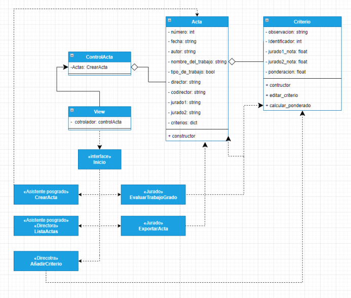

# Proyecto Actas de Grado

Sistema de información de la dirección de los posgrados en ingeniería de software de la Pontificia Universidad Javeriana Cali
que facilita la calificación de las actas de grado de maestría cuando los estudiantes realizan 
su sustentación pública. El sistema da la posibilidad de crear un archivo en formato PDF con los resultados de la 
calificación obtenida por el estudiante y los comentarios relacionados con la evaluación. Esta evaluación se registra
en un acta de evaluación que es diligenciada luego de la sustentación por los dos jurados participantes y está 
compuesta por:

* ID, fecha, autor, nombre del trabajo, tipo de trabajo (Aplicado o Investigación), director, 
co-director (si aplica), jurado uno y jurado dos. 
* Criterios de evaluación. Actualmente, son 8 criterios de evaluación, pero podrían extenderse en el futuro. 
Cada criterio tiene una descripción y un porcentaje de ponderación. El porcentaje de ponderación está definido por la dirección de los posgrados. 
Eventualmente, podría ser ajustados por el director. 
* En el acta para cada criterio de evaluación se incluye la calificación de acuerdo a la nota del jurado número uno y el 
jurado número dos, junto con las observaciones para el criterio. 
* El acta permite incluir observaciones adicionales y comentarios específicos sobre las condiciones para la 
aprobación del trabajo final.
* Al final de cada acta se incluye un espacio en el que los jurados ponen sus firmas. Además, de la calificación final de todos los criterios.
___
# Manual técnico

> Class `Acta`
___
